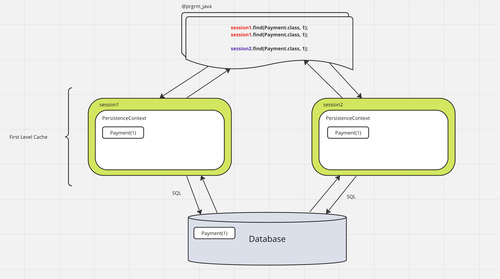
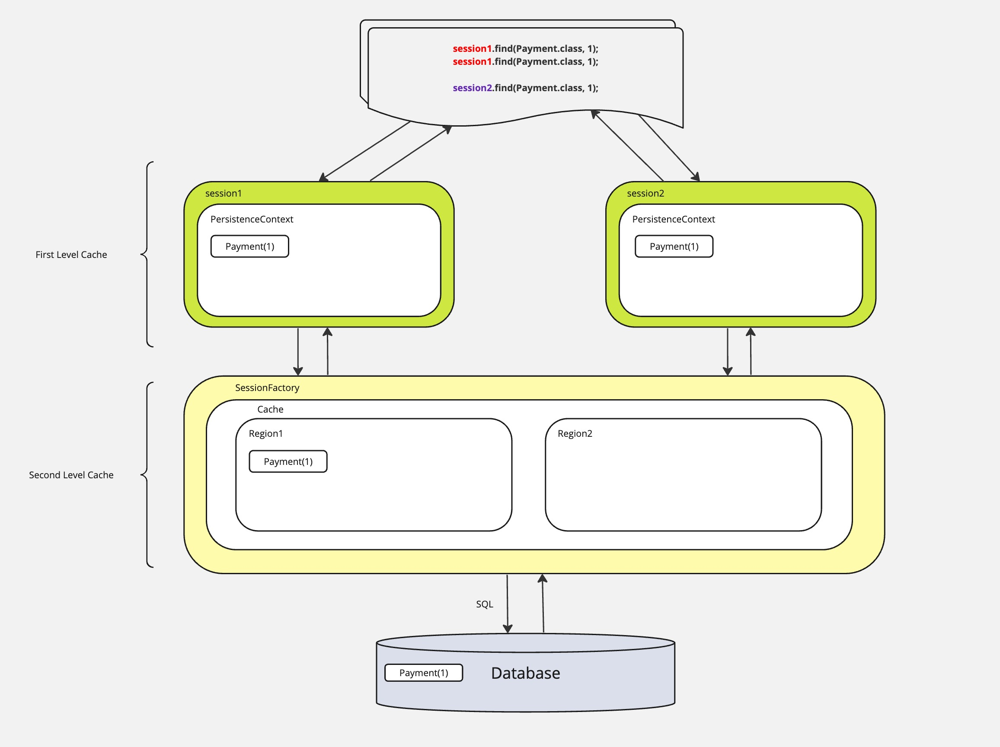

## N+1 SELECT

Проблема N+1 - это проблема производительности, которая возникает, когда фреймворк доступа к данным выполняет дополнительные запросы SQL для получения тех же данных, которые могли бы быть получены при выполнении первичного запроса SQL.
Вместо того, чтобы выполнять запрос N+1 раз, его можно выполнить всего два раза: один раз для родительских записей и один раз для дочерних записей. Это называется **батчингом** или **размером пакета**.

Что касается **декартового произведения множеств**, это операция, которая возвращает набор всех возможных комбинаций пар элементов из двух множеств. Например, если у нас есть два множества A = {2, -2, 3} и B = {1, -4}, то декартово произведение A × B будет {(2, 1), (2, -4), (-2, 1), (-2, -4), (3, 1), (3, -4)}.

В контексте ORM (Object-Relational Mapping), декартово произведение может возникнуть при выполнении запросов к нескольким связанным таблицам, что может привести к избыточным результатам и снижению производительности. Однако, правильное использование батчинга и понимание декартового произведения множеств может помочь оптимизировать эти запросы и улучшить производительность.

### Решение проблем N+1:
- Решение проблемы N+1 с помощью батчинга или размера пакета сводится к минимизации количества запросов к базе данных. Вместо выполнения отдельного запроса для каждой записи, вы можете выполнить всего два запроса: один для родительских записей и один для дочерних. Можно использовать аннотацию @BatchSize над полем так и над классом.  
- @Fetch - это аннотация Hibernate, которая позволяет оптимизировать запросы к базе данных и решить проблему N+1.
Она позволяет указать стратегию выборки для связанных сущностей. Например, @Fetch(FetchMode.JOIN) говорит Hibernate использовать операцию JOIN для выборки связанных сущностей, что может помочь избежать проблемы N+1.

@Fetch, @FetchProfile, и Query Fetch - это аннотации Hibernate, которые используются для оптимизации запросов к базе данных.

@Fetch: Эта аннотация позволяет указать стратегию выборки для связанных сущностей. 
Например, @Fetch(FetchMode.JOIN) говорит Hibernate использовать операцию JOIN для выборки связанных сущностей. Однако стоит отметить, что использование @Fetch(FetchMode.JOIN) может привести к избыточным данным, если не использовать его правильно

Query Fetch: Это стратегия выборки, которая используется при выполнении запроса. Она позволяет явно указать, какие связанные сущности следует выбирать вместе с основной сущностью.
```java
// HQL
List<User> list = session.createQuery("select u from User u" +
                                                  " join fetch u.payments " +
                                                  " join fetch u.company" +
                                                  " where 1 = 1", User.class)
                    .list(); // в данном случае мы достали все в одном запросе.

// Criteria API
public List<Payment> findAllPaymentsByCompanyName(Session session, String companyName) {
    HibernateCriteriaBuilder cb = session.getCriteriaBuilder();
    JpaCriteriaQuery<Payment> criteria = cb.createQuery(Payment.class);

    JpaRoot<Payment> payment = criteria.from(Payment.class);
    JpaJoin<Payment, User> user = payment.join(Payment_.receiver);
    payment.fetch(Payment_.receiver); // в criteria делаем через ключевое слово fetch

    JpaJoin<User, Company> company = user.join(User_.company);

    criteria.select(payment).where(
                    cb.equal(company.get(Company_.name), companyName)
            )
            .orderBy(cb.asc(user.get(User_.personalInfo).get(PersonalInfo_.firstname)),
                    cb.asc(payment.get(Payment_.amount))
            );

    return session.createQuery(criteria)
            .list();
}

// HibernateQuery
public List<User> findAllByCompanyName(Session session, String companyName) {
    return new HibernateQuery<User>(session)
            .select(user)
            .from(company)
            .join(company.users, user).fetchJoin() 
            .where(company.name.eq(companyName))
            .fetch();
}
```


@FetchProfile: Эта аннотация позволяет определить профиль выборки, который можно затем применить к сессии или запросу. Это позволяет динамически изменять стратегию выборки в зависимости от контекста
```java
@FetchProfile(name = "withCompanyAndPayment", fetchOverrides = {
        @FetchProfile.FetchOverride(
                entity = User.class,
                association = "company", // поле в классе User
                mode = FetchMode.JOIN
        ),
        @FetchProfile.FetchOverride(
                entity = User.class,
                association = "payments", // поле в классе User
                mode = FetchMode.JOIN
        )
})
@Entity
public class User implements Comparable<User>, BaseEntity<Long> {
     // code
}
```
Пример использования:
```java
public class HibernateRunner {
    public static void main(String[] args) {
        try(SessionFactory sessionFactory = HibernateUtil.buildSessionFactory();
            Session session = sessionFactory.openSession()) {
            session.beginTransaction();
            session.enableFetchProfile("withCompanyAndPayment");

            User user = session.get(User.class, 1L);
            System.out.println(user.getCompany().getName());

            session.getTransaction().commit();
        }
    }
}
```

### Entity Graphs
Entity Graphs - это механизм, используемый в Java Persistence API (JPA), который позволяет эффективно извлекать данные из базы данных, особенно когда необходимо загружать связанные сущности с определенными атрибутами.
Это особенно полезно в сценариях, где вы хотите избежать `нежелательного` загрузки всех данных.

Есть несколько способов сделать это:

1) Это использовать аннотацию @NamedEntityGraph где прописываем в параметрах названия данного графа, название полей в параметре attributeNodes, которые нужно будет загрузить, и при необходимости также написать subgraphs:
```java
@NamedEntityGraph(
        name = "withCompanyAndChat",
        attributeNodes = {
                @NamedAttributeNode("company"),
                @NamedAttributeNode(value = "userChats", subgraph = "chats")
        },
        subgraphs = {
                @NamedSubgraph(name = "chats", attributeNodes = @NamedAttributeNode("chat"))
        }
)
@Entity
public class User implements Comparable<User>, BaseEntity<Long> {
    // code 
}
```
Пример использования:
```java
public class HibernateRunner {
    public static void main(String[] args) {
        try(SessionFactory sessionFactory = HibernateUtil.buildSessionFactory();
            Session session = sessionFactory.openSession()) {
            session.beginTransaction();
            

            Map<String, Object> properties = Map.of(
                  GraphSemantic.LOAD.getJakartaHintName(), session.getEntityGraph("withCompanyAndChat")
            );
            User user = session.find(User.class, 1L, properties);

            System.out.println(user.getCompany().getName());
            System.out.println(user.getUserChats().size());

            // можно использовать как и в find(аналог get) так и в query
            List<User> users = session.createQuery("select u from User u where 1 = 1", User.class)
                    .setHint(GraphSemantic.LOAD.getJakartaHintName(), session.getEntityGraph("withCompanyAndChat"))
                    .list();

            users.forEach(it -> System.out.println(it.getCompany().getName()));
            users.forEach(it -> System.out.println(it.getUserChats().size()));


            session.getTransaction().commit();
        }
    }
}
```
2) Использовать java код:
```java
public class HibernateRunner {
    public static void main(String[] args) {
        try(SessionFactory sessionFactory = HibernateUtil.buildSessionFactory();
            Session session = sessionFactory.openSession()) {
            session.beginTransaction();

            RootGraph<User> userGraph = session.createEntityGraph(User.class); // создания EntityGraph для класса User
            userGraph.addAttributeNodes("company", "userChats"); // задаются атрибуты, которые должны быть загружены. В данном случае, атрибуты "company" и "userChats" сущности User.
            SubGraph<UserChat> userChatSubGraph = userGraph.addSubgraph("userChats", UserChat.class); 
            userChatSubGraph.addAttributeNodes("chat"); // Добавляется подграф для атрибута "userChats". В этом подграфе указывается, что также нужно загрузить атрибут "chat" сущности UserChat.

            Map<String, Object> properties = Map.of(
                    GraphSemantic.LOAD.getJakartaHintName(), userGraph
            );
            User user = session.find(User.class, 1L, properties);

            System.out.println(user.getCompany().getName());
            System.out.println(user.getUserChats().size());

            session.getTransaction().commit();
        }
    }
}
```
Есть два типа для `GraphSemantic` это LOAD что используется в коде и второй это FETCH.
 - `GraphSemantic.LOAD` - это семантика графа, которая указывает `Hibernate` загружать связанные сущности при выполнении запроса.
 - Что касается второго типа `GraphSemantic.FETCH`, то загружать связанные сущности будут так как мы указали в `FetchType`

## Best Practices
- Избегать `bidirectional` связи в `OneToOne`
- Использовать `LAZY` везде
- Не следует использовать @BatchSize (так как он вообще не решает проблему N+1), @Fetch
- Использовать ключевое слово fetch (`HQL, Criteria API, Querydsl, HibernateQuery`)
- Предпочитать `Entity Graph API` чем @FetchProfile


`Транзакция` - единица работы в рамках соединения с базой данных. Она либо выполняется полностью (`commit`), либо полностью откатывается (`rollback`)

ACID - набор свойств, которыми должна обладать транзакция БД.
- A - Atomicity 
- C - Consistency
- I - Isolation
- D - Durability

`Atomicity`(Атомарность) - гарантирует, что никакая транзакция не будет зафиксирована в системе частично. Будут либо выполнены все ее подоперации, либо не выполнено ни одной. \
`Consistency`(Согласованность) - каждая успешная транзакция фиксирует только допустимые результаты. \
`Isolation`(Изолированность) - во время выполнения транзакции паралельные транзакции не должны оказывать влияние на результат. \
`Durability`(Устойчивость) - независимо от проблем на нижних уровнях изменения, сделанные успешно завершенной транзакцией, должны остаться сохранеными после возвращения в работу.  

-------------

### Transaction isolation issues
- Lost Update - потерянное обновление 
- Dirty Read - "грязное" чтение
- Non Repeatable Read - неповторяющиееся чтение
- Phantom Read - фантомное чтение

**Lost Update** - Происходит, когда обе транзакции одновременно обновляют данные и затем вторая транзакция откатывает изменения, вследствие чего изменения обеих транзакций теряются \
**Dirty Read** - Происходит, когда первая транзакция читает изменения, сделанные другой транзакцией, но эти изменения еще не были ей закомичены. После чего вторая транзакция откатывает эти изменения, а первая продолжает работу с «грязными» данными \
**Non Repeatable Read** - Происходит, когда первая транзакция читает одни и те же данные дважды, но после первого прочтения вторая транзакция изменяет (update) эти же данные и делает коммит, вследствие чего вторая выборка в первой транзакции вернет другой результат \
**Phantom Read** - Происходит, когда первая транзакция читает одни и те же данные дважды, но после первого прочтения вторая транзакция добавляет новые строки или удаляет старые и делает коммит, вследствие чего вторая выборка в первой транзакции вернет другой результат (разное количество записей)

### FIRST AND SECOND LEVEL CACHE
[//]: # (TODO добавить second level cache в проект)




